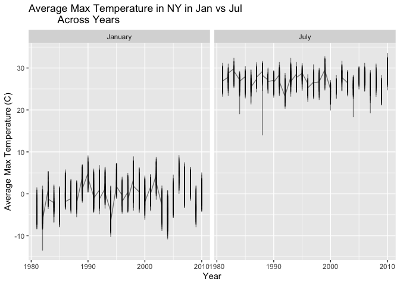
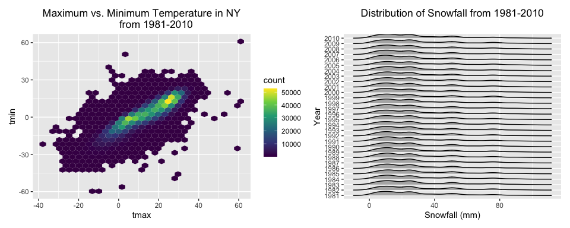
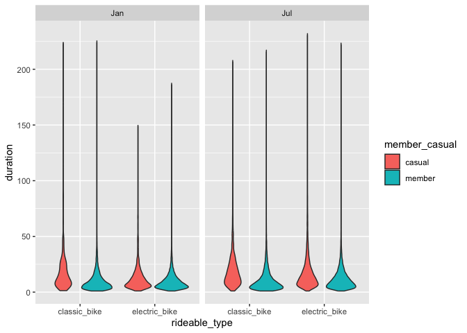

Homework 3
================
Malika Top
2024-10-14

### Problem 1

``` r
library(p8105.datasets)
data("ny_noaa")
dim(ny_noaa)
```

    ## [1] 2595176       7

``` r
summary(ny_noaa)
```

    ##       id                 date                 prcp               snow       
    ##  Length:2595176     Min.   :1981-01-01   Min.   :    0.00   Min.   :  -13   
    ##  Class :character   1st Qu.:1988-11-29   1st Qu.:    0.00   1st Qu.:    0   
    ##  Mode  :character   Median :1997-01-21   Median :    0.00   Median :    0   
    ##                     Mean   :1997-01-01   Mean   :   29.82   Mean   :    5   
    ##                     3rd Qu.:2005-09-01   3rd Qu.:   23.00   3rd Qu.:    0   
    ##                     Max.   :2010-12-31   Max.   :22860.00   Max.   :10160   
    ##                                          NA's   :145838     NA's   :381221  
    ##       snwd            tmax               tmin          
    ##  Min.   :   0.0   Length:2595176     Length:2595176    
    ##  1st Qu.:   0.0   Class :character   Class :character  
    ##  Median :   0.0   Mode  :character   Mode  :character  
    ##  Mean   :  37.3                                        
    ##  3rd Qu.:   0.0                                        
    ##  Max.   :9195.0                                        
    ##  NA's   :591786

The `ny_noaa` dataframe contains core information for all New York state
stations from the National Oceanic and Atmospheric Association (NOAA)’s
database. It is a rather massive dataframe with 2595176 rows and 7
columns. The key variables are:

- `date`: the date of observation
- `prcp`: rain precipitation levels (in tenths of mm)
- `snow`: snowfall levels (in mm)
- `swd`: snow depth (in mm)
- `tmax`: maximum temperature (tenths of degrees C)
- `tmin`: minimum temperature (tenths of degrees C)

There is a significant chunk of values missing from this dataframe and
looking at the `summary` command, there are 145,838 NA values for
`prcp`, 381,221 NA values for `snow`, and 591,786 for `snowd`. In a
dataframe with 2,595,176 total rows, we might not be concerned too much
for `prcp` but definitely for `snowd`.

#### Data Cleaning

``` r
cleaned_noaa = 
  ny_noaa |> 
  mutate(
    date = as.Date(date),
    month = month(date),
    day = day(date),
    year = year(date),
    tmin = as.integer(tmin) / 10,
    tmax = as.integer(tmax) / 10,
    prcp = as.integer(prcp) / 10
  )
```

In the description of this data, it is listed that the weather variables
are listed as having units that are in tenths of degrees Celsius or
millimeters. That means that in cleaning this data, we have to divide
the degrees by 10 to get the actual temperature. Assuming the same
pattern for `prcp`, we also divide by 10. `snow` and `snowd` appear to
be in correct units. Additionally, I converted the `date` variable to be
a DateTime object to more easily extract the `month`, `day`, `year`
columns.

#### Common Snowfall Measurements

``` r
head(
  cleaned_noaa |> 
  group_by(snow) |> 
  summarise(n_obs = n())
)
```

    ## # A tibble: 6 × 2
    ##    snow   n_obs
    ##   <int>   <int>
    ## 1   -13       1
    ## 2     0 2008508
    ## 3     3    8790
    ## 4     5    9748
    ## 5     8    9962
    ## 6    10    5106

**The most commonly observed value for snowfall was 0 mm.**

#### Average Max. Temperatures

``` r
month_levels = c(`1` = "January", `7` = "July")
avg_max_01_07_plot = 
  cleaned_noaa |> 
  filter(month == 1 | month == 7) |> 
  group_by(id, month, year) |> 
  summarise(avg_max = mean(tmax)) |> 
  ggplot(aes(x = year, y = avg_max)) + 
  geom_line(size=0.5, alpha=0.5) +
  facet_grid(~month, labeller = as_labeller(month_levels)) +
  labs(
    x = "Year",
    y = "Average Max Temperature (C)"
  ) + 
  ggtitle("Average Max Temperature in NY in Jan vs Jul
          Across Years") + 
  theme_update(plot.title = element_text(hjust = 0.5)) +
  viridis::scale_color_viridis(
    discrete = TRUE
  )
```

    ## `summarise()` has grouped output by 'id', 'month'. You can override using the
    ## `.groups` argument.

    ## Warning: Using `size` aesthetic for lines was deprecated in ggplot2 3.4.0.
    ## ℹ Please use `linewidth` instead.
    ## This warning is displayed once every 8 hours.
    ## Call `lifecycle::last_lifecycle_warnings()` to see where this warning was
    ## generated.

``` r
avg_max_01_07_plot
```

    ## Warning: Removed 1 row containing missing values or values outside the scale range
    ## (`geom_line()`).

<!-- --> We
see that the average maximum temperature in July is considerably higher
than in January which makes sense since summer is hotter than winter.
Over time though, the temperatures oscillate back and forth with no
consistent pattern as one might expect with climate change, although
July weather in 2010 looks the highest. There are some particularly cool
January’s, such as in the early 1980s, and a particularly cool July in
the late 1980s.

#### tmax vs. tmin

``` r
tmax_v_tmin = 
  ggplot(cleaned_noaa, aes(x = tmax, y = tmin)) + 
  geom_hex() +
  ggtitle("Maximum vs. Minimum Temperature in NY
          from 1981-2010") + 
  scale_fill_viridis_c()


options(repr.plot.width =9, repr.plot.height = 15) 
snowfall_dist_plot =
  cleaned_noaa |> 
  filter(snow > 0 & snow < 100) |> 
  na.omit() |> 
  group_by(year) |> 
  ggplot(aes(x = snow, y = factor(year))) +
  geom_density_ridges(scale = .85) +
  labs(
    x = "Snowfall (mm)",
    y = "Year"
  ) +
  ggtitle("Distribution of Snowfall from 1981-2010")

library(patchwork)
tmax_v_tmin + snowfall_dist_plot 
```

    ## Warning: Removed 1136276 rows containing non-finite outside the scale range
    ## (`stat_binhex()`).

    ## Picking joint bandwidth of 4.24

<!-- --> Looking
at the hexplot of `tmax` vs `tmin` for the full dataset, the most common
maximum temperatures are between 0 and 30 degrees Celsius and 0 to 30
for the minimum temperature as well. As for snowfall, with so many
years, it is a bit difficult to discern, but the amount of snowfall
seems to be fairly consistent - data including 2020 onwards would
probably be quite different though.

### Problem 2

#### Loading Data

``` r
# KEY: 1 = male, 2 = female, education = 1 = less than high school, 2 = high 
# school, 3 = more than high school
accel_demo_df = read.csv("data/nhanes_covar.csv", skip = 4) |> 
  janitor::clean_names()
accel_meter_df = read.csv("data/nhanes_accel.csv") |> 
  janitor::clean_names()
```

#### Tidying Data

``` r
accel_meter_tidy = 
  accel_meter_df |> 
  pivot_longer(
    min1:min1440,
    names_to = "minute",
    names_prefix = "min",
    values_to = "mims_val"
  )
```

#### Merging and further cleaning

``` r
education_levels = c(
  `1`= "Less than high school",
  `2` = "High school equivalent",
  `3` = "More than high school"
)
accel_comb = 
  left_join(accel_meter_tidy, accel_demo_df, by = "seqn") |> 
  filter(age >= 21) |> 
  na.omit() |> 
  mutate(
    education = case_match(
      education, 
      1 ~ "Less than high school",
      2 ~ "High school equivalent", 
      3 ~ "More than high school"
    ),
    education = as.factor(education),
    sex = case_match(
      sex,
      1 ~ "male",
      2 ~ "female"
    ),
    sex = as.factor(sex),
    minute = as.integer(minute)
  )
```

##### Gender, Education, and Age

``` r
gender_educ =
  accel_comb |> 
  distinct(seqn, .keep_all = TRUE) |>
  group_by(education, sex) |>
  summarize(
    count = n_distinct(seqn)
  ) |> 
  pivot_wider(
    names_from = "sex",
    values_from = "count"
  ) 
```

    ## `summarise()` has grouped output by 'education'. You can override using the
    ## `.groups` argument.

``` r
gender_educ_table = 
  gender_educ |> 
  knitr::kable()
gender_educ_table
```

| education              | female | male |
|:-----------------------|-------:|-----:|
| High school equivalent |     23 |   35 |
| Less than high school  |     28 |   27 |
| More than high school  |     59 |   56 |

Looking at the table for the number of men and women in each education
category, gender is split pretty evenly with the exception for the “high
school equivalent” category which has a lot more men.

``` r
age_dist_by_sex = 
  accel_comb |> 
  distinct(seqn, .keep_all = TRUE) |>
  group_by(education, sex) |> 
  ggplot(aes(x = age, fill = sex)) +
  geom_density() +
  facet_grid(~education) + 
  labs(
    x = "Age",
    y = "Frequency"
  ) +
  ggtitle("Age Distribution for Gender Across Education Levels") +
  theme_update(plot.title = element_text(hjust = 0.5)) 
  
age_dist_by_sex
```

<!-- -->

Looking at the graph above, for those with the equivalent of a high
school education, there are similar amounts of female and male
participants between 20 and 60 years old, but for the range of 60-80,
more female. From the middle panel, we can see that the gender
distribution is fairly similar across all ages. For those with more than
a high school education within the 20-40 age range, there’s much more
female participants than male.

``` r
accel_aggregate_df = 
  accel_comb |> 
  group_by(seqn) |> 
  summarize(
    daily_mims = sum(mims_val)
  )

distinct_users = 
  accel_comb |> 
  distinct(seqn, .keep_all = TRUE)
distinct_users = 
  merge(distinct_users, accel_aggregate_df, by = "seqn")

total_mims_dist_plot =
distinct_users |> 
  ggplot(aes(x=age, y = daily_mims, color = sex)) +
  geom_point() + 
  geom_smooth(se = FALSE) +
  facet_grid(~education) +
  labs(
    x = "Age",
    y = "Total Daily Activity (MIMS)",
    color = "sex"
  ) +
  ggtitle("Comparing Daily Activity Against Age Across Sex and Education Level") +
  theme_update(plot.title = element_text(hjust = 0.5))

total_mims_dist_plot
```

    ## `geom_smooth()` using method = 'loess' and formula = 'y ~ x'

<!-- --> We see
that the decline in total daily activity across genders follow similar
trends, with the most observable differences existing across education
levels. For example, for participants with a high school equivalent
education, the biggest decline happens in the 40s, whereas for those
with less than high school, the decline happens in the 60s. Those with
more than high school, don’t have as steep of a decrease in activity as
the other education levels.

``` r
time_course = 
  accel_comb |>
  group_by(seqn) |> 
  mutate(
    hour = ceiling(minute/60)
  ) |> 
  group_by(seqn, hour) |> 
  mutate(
    total_hourly_mims = sum(mims_val)
  )

time_course_plot = 
  time_course |> 
  group_by(seqn, hour) |> 
  ggplot(aes(x = hour, y = total_hourly_mims, color = sex)) +
  geom_line(alpha = 0.5) +
  geom_smooth(se = FALSE) +
  facet_grid(~education) +
  labs(x = "Hour", y = "Total MIMS per Hour") +
  ggtitle("24-hour Activity Time Courses Across Sex and Education")
time_course_plot
```

    ## `geom_smooth()` using method = 'gam' and formula = 'y ~ s(x, bs = "cs")'

<!-- --> The
trend lines across education levels for female vs male participants’
hourly MIMS look similar, but for those with more than a high school
education, there appear to be some observations that have much higher
activity levels, with some maximum values exceeding other education
levels by more than 1000 MIMS.

### Problem 3

#### Loading data

``` r
citi_jan2020 = read_csv("data/citibike/Jan 2020 Citi.csv")
```

    ## Rows: 12420 Columns: 7
    ## ── Column specification ────────────────────────────────────────────────────────
    ## Delimiter: ","
    ## chr (6): ride_id, rideable_type, weekdays, start_station_name, end_station_n...
    ## dbl (1): duration
    ## 
    ## ℹ Use `spec()` to retrieve the full column specification for this data.
    ## ℹ Specify the column types or set `show_col_types = FALSE` to quiet this message.

``` r
citi_jan2024 = read_csv("data/citibike/Jan 2024 Citi.csv")
```

    ## Rows: 18861 Columns: 7
    ## ── Column specification ────────────────────────────────────────────────────────
    ## Delimiter: ","
    ## chr (6): ride_id, rideable_type, weekdays, start_station_name, end_station_n...
    ## dbl (1): duration
    ## 
    ## ℹ Use `spec()` to retrieve the full column specification for this data.
    ## ℹ Specify the column types or set `show_col_types = FALSE` to quiet this message.

``` r
citi_jul2020 = read_csv("data/citibike/July 2020 Citi.csv")
```

    ## Rows: 21048 Columns: 7
    ## ── Column specification ────────────────────────────────────────────────────────
    ## Delimiter: ","
    ## chr (6): ride_id, rideable_type, weekdays, start_station_name, end_station_n...
    ## dbl (1): duration
    ## 
    ## ℹ Use `spec()` to retrieve the full column specification for this data.
    ## ℹ Specify the column types or set `show_col_types = FALSE` to quiet this message.

``` r
citi_jul2024 = read_csv("data/citibike/July 2024 Citi.csv")
```

    ## Rows: 47156 Columns: 7
    ## ── Column specification ────────────────────────────────────────────────────────
    ## Delimiter: ","
    ## chr (6): ride_id, rideable_type, weekdays, start_station_name, end_station_n...
    ## dbl (1): duration
    ## 
    ## ℹ Use `spec()` to retrieve the full column specification for this data.
    ## ℹ Specify the column types or set `show_col_types = FALSE` to quiet this message.

``` r
# Checking for NA values
colSums(is.na(citi_jan2020)>0)
```

    ##            ride_id      rideable_type           weekdays           duration 
    ##                  0                  0                  0                  0 
    ## start_station_name   end_station_name      member_casual 
    ##                  2                 22                  0

``` r
colSums(is.na(citi_jan2024)>0)
```

    ##            ride_id      rideable_type           weekdays           duration 
    ##                  0                  0                  0                  0 
    ## start_station_name   end_station_name      member_casual 
    ##                 14                 56                  0

``` r
colSums(is.na(citi_jul2020)>0)
```

    ##            ride_id      rideable_type           weekdays           duration 
    ##                  0                  0                  0                  0 
    ## start_station_name   end_station_name      member_casual 
    ##                  0                 35                  0

``` r
colSums(is.na(citi_jul2024)>0)
```

    ##            ride_id      rideable_type           weekdays           duration 
    ##                  0                  0                  0                  0 
    ## start_station_name   end_station_name      member_casual 
    ##                 27                 94                  0

#### Combining and cleaning

``` r
citi_jan2020 = 
  citi_jan2020 |> 
  mutate(time_period = "Jan 2020")
citi_jan2024 = 
  citi_jan2024 |> 
  mutate(time_period = "Jan 2024")
citi_jul2020 = 
  citi_jul2020 |> 
  mutate(time_period = "Jul 2020")
citi_jul2024 = 
  citi_jul2024 |> 
  mutate(time_period = "Jul 2024")

weekday_level = c("Mon", "Tue", "Wed", 
                 "Thu", "Fri", "Sat",
                 "Sun")
citi_combined = 
  rbind(citi_jan2020, citi_jan2024, citi_jul2020, citi_jul2024) |> 
  separate(time_period, c("month", "year"), remove = FALSE) |> 
  mutate(
    weekdays = case_match(
      weekdays,
      "Monday" ~ "Mon",
      "Tuesday" ~ "Tue",
      "Wednesday" ~ "Wed",
      "Thursday" ~ "Thu",
      "Friday" ~ "Fri", 
      "Saturday" ~ "Sat",
      "Sunday" ~ "Sun"),
    weekdays = factor(weekdays, levels = weekday_level),
    rideable_type = as.factor(rideable_type),
    member_casual = as.factor(member_casual)
  )
```

#### Casual vs Member Numbers

``` r
member_period_table =
  citi_combined |> 
  group_by(member_casual, time_period) |> 
  summarise(n_obs = n()) |> 
  pivot_wider(
    names_from = "time_period", 
    values_from = "n_obs"
  ) |> 
  knitr::kable()
```

    ## `summarise()` has grouped output by 'member_casual'. You can override using the
    ## `.groups` argument.

``` r
member_period_table
```

| member_casual | Jan 2020 | Jan 2024 | Jul 2020 | Jul 2024 |
|:--------------|---------:|---------:|---------:|---------:|
| casual        |      984 |     2108 |     5637 |    10894 |
| member        |    11436 |    16753 |    15411 |    36262 |

Comparing the number of casual vs member riders across January vs July
confirms what we might expect which is that more people are riding bikes
in the summer month. Notably, from July 2020 to July 2024, we also see a
**huge, nearly two-fold** increase in both casual and member riders,
which makes sense since bike-riding was extremely popular as both an
activity and means of transportation.

#### July 2024’s 5 most popular starting stations

``` r
pop_station_0724 = 
  head(
    citi_jul2024 |> 
    group_by(start_station_name) |> 
    summarize(n_obs = n()) |> 
    arrange(desc(n_obs))
  , 5) |> 
  knitr::kable()
pop_station_0724
```

| start_station_name       | n_obs |
|:-------------------------|------:|
| Pier 61 at Chelsea Piers |   163 |
| University Pl & E 14 St  |   155 |
| W 21 St & 6 Ave          |   152 |
| West St & Chambers St    |   150 |
| W 31 St & 7 Ave          |   146 |

The most popular starting stations are in downtown Manhattan.

#### Median ride duration

Make a plot to investigate the effects of day of the week, month, and
year on median ride duration. This plot can include one or more panels,
but should facilitate comparison across all variables of interest.
Comment on your observations from this plot.

``` r
median_duration_by_weekday =
  citi_combined |> 
  group_by(weekdays, month, year) |> 
  summarise(
  median_ride_duration = median(duration)) |> 
  ggplot(aes(x = weekdays, y = median_ride_duration, fill = month)) +
  geom_col(position = "dodge2") +
  facet_grid(~year)
```

    ## `summarise()` has grouped output by 'weekdays', 'month'. You can override using
    ## the `.groups` argument.

``` r
median_duration_by_weekday
```

<!-- -->
Surprisingly, median ride durations were higher for 2020, and comparing
across months, July was higher. This might make sense though because
with the COVID pandemic, bike-riding may have been an outdoor activity
for people to do to relieve stress and get outside. For 2024 as well, we
see July has higher medians, and that’s justified by people being more
likely to ride outdoor bikes when it’s not freezing outside. Expectedly,
we also see that the rides are longer for Saturday and Sundays which
makes sense because during the weekends, people have more time.

#### 2024 Information

``` r
citi2024 = 
  citi_combined |> 
  filter(year == "2024") 

citi_2024_plot = 
  citi2024 |>
  ggplot(aes(x = rideable_type, y = duration)) +
  geom_violin(aes(fill = member_casual)) +
  facet_grid(~month) 
citi_2024_plot
```

<!-- -->

Looking at the above graph, the violin plots seem similar to each other,
with the exception of the electric bikes in January which have smaller
ride duration times. This might be because it’s more dangerous to ride
e-bikes when it’s colder and more slippery. Across membership status,
CITI members have a more distinctly right-skewed distribution for
duration,
